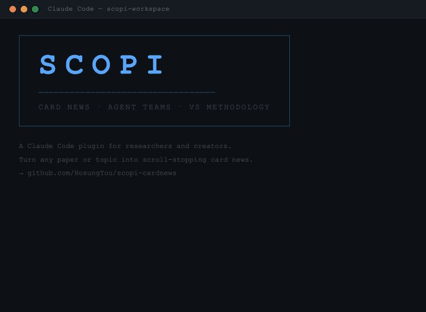

```
 ____   ____  ___  ____  ___
/ ___| / ___|/ _ \|  _ \|_ _|
\___ \| |   | | | | |_) || |
 ___) | |___| |_| |  __/ | |
|____/ \____|\___/|_|   |___|
  Card News  ·  Agent Teams  ·  VS Methodology
```

> **A Claude Code plugin for researchers and creators.**
> Turn any paper, topic, or idea into scroll-stopping social card news —
> without the generic AI aesthetic.

[](https://github.com/HosungYou/scopi-cardnews/releases)
[](LICENSE)
[](https://claude.ai/code)

---

## Demo



*SCOPI logo → pre-flight confirmation → NARA VS story arcs → Design Team debate → GANA output*

---

## Why Scopi

Most AI content tools call a single model once and give you one output. The result looks like every other AI-generated post: uniform layout, safe word choices, template aesthetics.

Scopi is different on two axes:

### 1 — Agent Teams, Not a Single LLM

```
┌─────────────────────────────────────────────────────────────────┐
│  /scopi:generate "topic" --teams                                │
└──────────────────────────┬──────────────────────────────────────┘
                           │
                    ┌──────▼──────┐
                    │    NARA     │  Content strategist
                    │  VS: 3 arcs │  Generates 3 story directions
                    │  T-scored   │  with entropy T-scores
                    └──────┬──────┘
                           │  user locks direction
          ┌────────────────▼────────────────────┐
          │           Design Team                │  5 agents · parallel
          │                                      │  real-time messaging
          │  GYEOL ◄──────────────► JURI         │
          │  Visual Architect       Ethics        │
          │  VS: 3 directions       License &     │
          │  T-scored               copyright     │
          │       ▲                     ▲         │
          │       │                     │         │
          │  BINNA ◄──────────────► MARU          │
          │  Copy Surgeon           Empathy        │
          │  Hook, tone, CTA        Audience       │
          │                         scoring        │
          │              ▼                         │
          │            GANA                        │
          │       Slide Engineer                   │
          │    HTML/CSS · PNG · PDF                │
          └──────────────────────────────────────  ┘
                         │
              ┌──────────▼──────────┐
              │  8 PNG slides        │
              │  caption.txt         │
              │  Posting package     │
              └──────────────────────┘
```

**JURI** flags copyright issues in real-time. **MARU** scores audience resonance mid-design. **BINNA** negotiates copy constraints with the layout. Agents push back on each other — the output reflects that tension.

### 2 — VS Methodology (Anti-Mode-Collapse)

Every LLM has a "mode" — the most probable output given a prompt. That's why AI content looks the same.

VS (Verbalized Sampling) forces the agent out of its default mode by generating multiple alternatives with **T-scores** (temperature-analogue entropy scores). Lower T = more unconventional.

```
NARA generates 3 story arcs:

  T=0.71  Option A · Safe timeline narrative
  T=0.38  Option B · Data-led structure
  T=0.17  Option C · Reverse reveal — counterintuitive hook  ← recommended
```

The agent must propose, score, and justify each option. You choose. The design team then applies the same VS process to visual direction, typography, and layout — ensuring no two episodes look alike.

---

## The 7 Agents

| Agent | Role | Specialty |
|-------|------|-----------|
| **NARA** | Content Strategist | VS story arcs, emotional curves, series planning |
| **GYEOL** | Visual Architect | Free composition, theme system, anti-AI design rules |
| **GANA** | Slide Engineer | HTML/CSS pipeline, Puppeteer capture, 2× retina |
| **BINNA** | Copy Surgeon | Hook writing, tone calibration, CTA optimization |
| **DARI** | Audience Strategist | Platform captions, hashtag strategy, posting schedule |
| **JURI** | Ethics Inspector | Copyright, citation, academic integrity — read-only |
| **MARU** | Empathy Tester | Scroll-stop scoring, audience reaction — read-only |

> JURI and MARU are **read-only** — they never edit files, only message other agents with flags and scores. This prevents ethics and audience concerns from being overridden in the pursuit of speed.

---

## Output

Each run produces:

```
output/
├── slide-01.png  …  slide-08.png   # 2× retina PNGs (1080×1350)
├── carousel.pdf                    # Single-file Instagram carousel
└── caption.txt                     # Posting package
    ├── Instagram caption + hashtags
    ├── Threads thread (2-part)
    ├── Story scripts (3 slides)
    └── Posting checklist
```

---

## Quick Start

### Prerequisites

- [Claude Code](https://claude.ai/code) CLI
- Node.js 18+

### Install

```bash
# Add the Scopi marketplace
claude plugin marketplace add HosungYou/scopi-cardnews

# Install
claude plugin install scopi-cardnews@scopi-cardnews
```

### Configure your brand

```
/scopi:setup
```

A 10-step brand identity interview captures your voice, audience, visual style, and generates a dynamic theme. Output: `scopi.config.json`.

### Generate

```
/scopi:generate "your topic" --teams
```

`--teams` forces Agent Teams mode (parallel debate). Without the flag, auto-selects based on environment and content type.

---

## Theme Presets

Six production-ready themes. Specify `"preset"` in `scopi.config.json`:

| Preset | Mood | Best for |
|--------|------|---------|
| `deep-navy` | Data journalism | Research, statistics, academic |
| `ochre-and-ink` | Warm academic | Education, humanities |
| `celadon-grove` | Fresh, minimal | Science, environment |
| `plum-academic` | Deep, authoritative | Policy, philosophy |
| `slate-teal` | Cool, analytical | Technology, engineering |
| `charcoal-warm` | Editorial | Media, commentary |

```json
{
  "theme": {
    "preset": "deep-navy",
    "colors": { "accent": "#2A6496" }
  }
}
```

Inline overrides merge on top of the preset — change one color without rebuilding the theme.

---

## Commands

| Command | Description |
|---------|-------------|
| `/scopi:setup` | Brand identity interview → `scopi.config.json` |
| `/scopi:generate` | Full pipeline (auto-selects mode) |
| `/scopi:content` | Content ideation with NARA only |
| `/scopi:design` | Visual exploration with GYEOL only |
| `/scopi:build` | Capture existing HTML → PNG/PDF |
| `/scopi:caption` | Generate captions with DARI + BINNA |
| `/scopi:review` | QA review with JURI + MARU |
| `/scopi:theme` | View or regenerate theme |

---

## For Researchers

Scopi was built for academic content creators. It understands:

- **APA 7th citations** — paper titles on cover slides, full bibliographic references on CTA slides
- **Data visualization** — horizontal bar charts, stat comparisons, progress bars as native slide components
- **Source integrity** — JURI checks image licenses before embedding; citations verified before export
- **Academic voice** — BINNA calibrates tone for professional-warm, not corporate-bland

---

## Project Structure

```
scopi-cardnews/
├── agents/          # 7 agent persona files (NARA, GYEOL, GANA, …)
├── skills/          # User-invocable slash commands
├── templates/
│   ├── design-system.js    # Dynamic theme engine
│   ├── slide-renderer.js   # Component library
│   └── generate.js         # HTML → PNG → PDF pipeline
├── themes/          # 6 preset theme JSON files
└── scripts/
    ├── dev-mode.sh  # Symlink cache for instant dev updates
    └── deploy.sh    # One-command version bump + deploy
```

---

## License

MIT — [HosungYou](https://github.com/HosungYou)

---

<sub>Built with Claude Code · Agent Teams · VS Methodology</sub>
